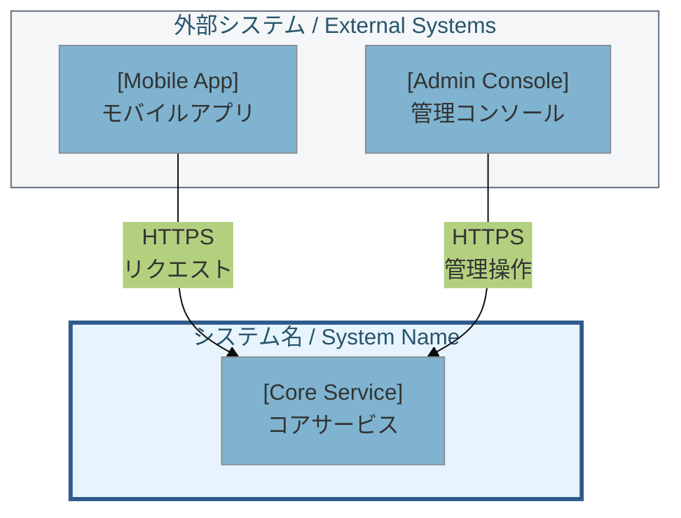
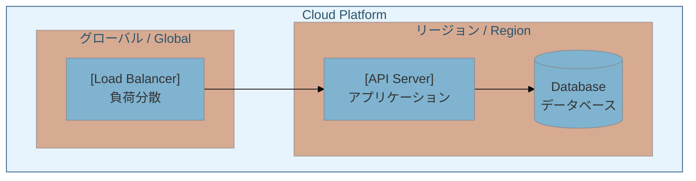
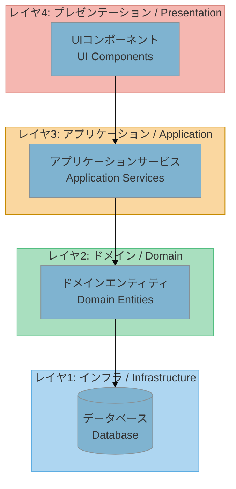
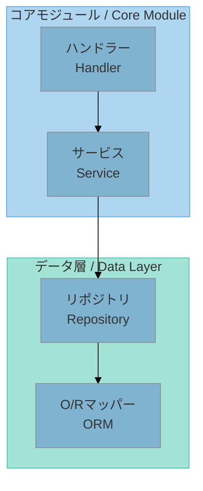
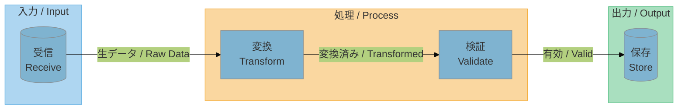
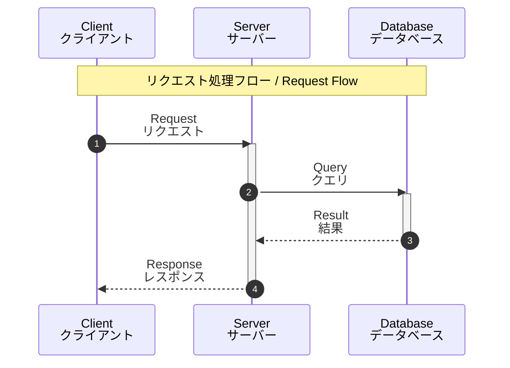
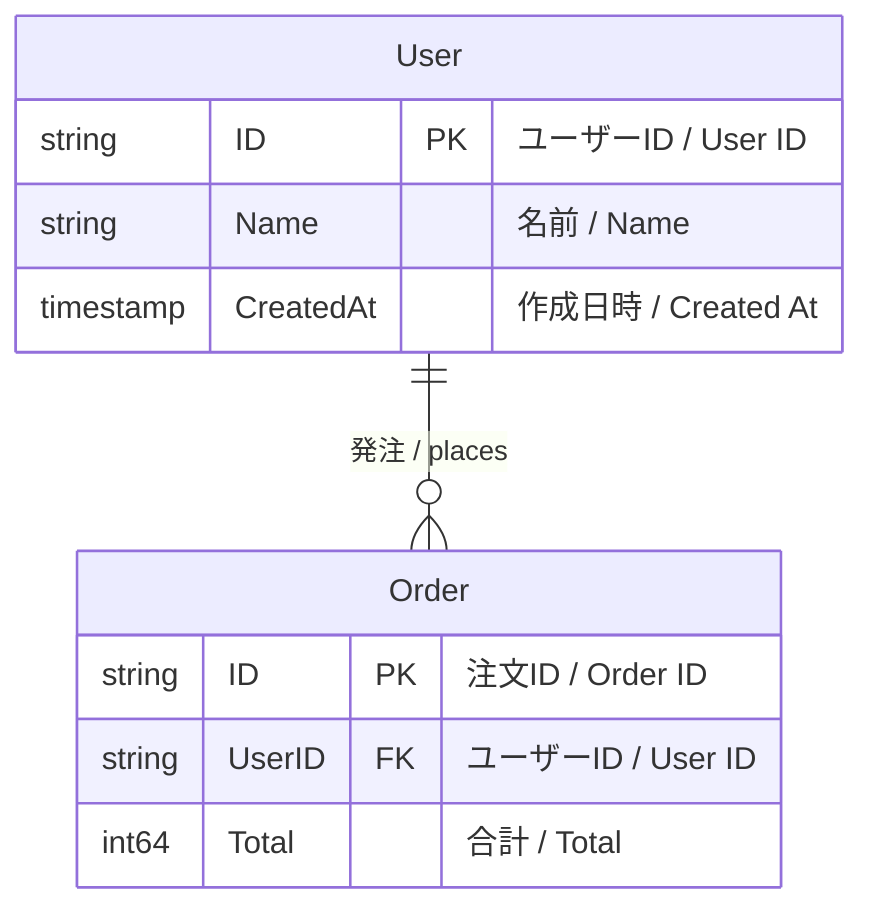
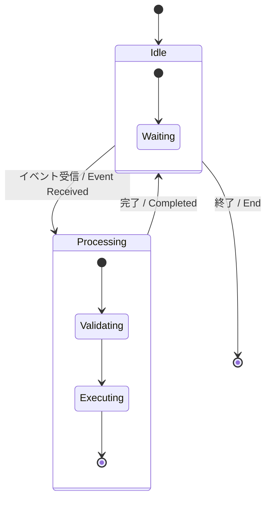
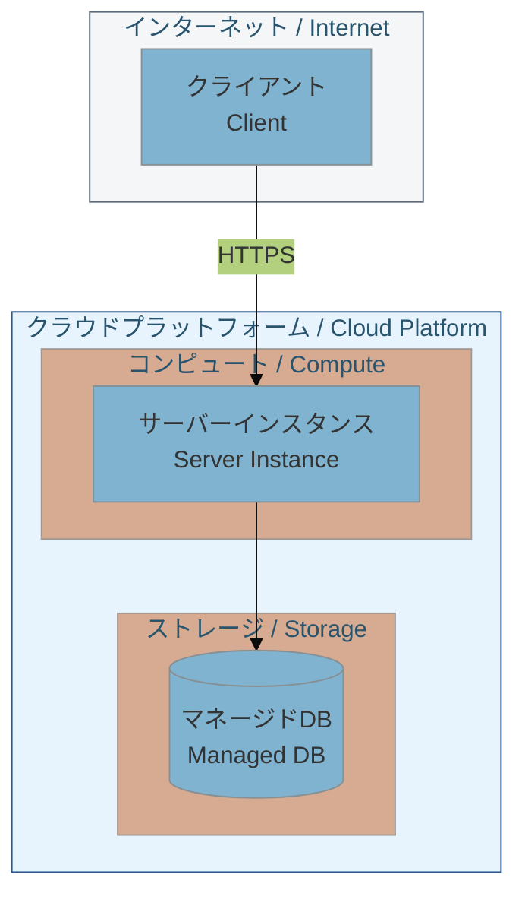
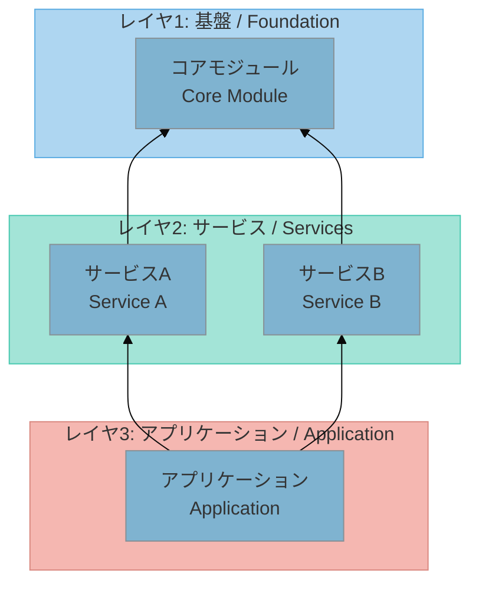

# Mermaid Diagram Patterns

## Table of Contents
1. [Theme Configuration](#theme-configuration)
2. [Color Schemes](#color-schemes)
3. [C4 System Context](#c4-system-context)
4. [C4 Container](#c4-container)
5. [Layered Architecture](#layered-architecture)
6. [Component Diagram](#component-diagram)
7. [Data Flow](#data-flow)
8. [Sequence Diagram](#sequence-diagram)
9. [ER Diagram](#er-diagram)
10. [State Diagram](#state-diagram)
11. [Deployment Diagram](#deployment-diagram)
12. [Dependency Diagram](#dependency-diagram)

---

## Theme Configuration

Base theme with custom colors:
```mermaid
%%{init: {'theme': 'base', 'themeVariables': {
  'primaryColor': '#7FB3D0',
  'primaryTextColor': '#333',
  'primaryBorderColor': '#5DADE2',
  'lineColor': '#85929E'
}}}%%
```

---

## Color Schemes

### Layer Colors (top to bottom) - Pastel Palette
| Layer | Fill | Stroke |
|-------|------|--------|
| Entry | `#5D6D7E` | `#4A4d60` |
| Presentation | `#F5B7b1` | `#D98880` |
| Application | `#FAD7A0` | `#C68A00` |
| Service | `#F9E79F` | `#D4AC00` |
| Domain | `#A9DFBF` | `#52BE80` |
| Data Access | `#A3E4D7` | `#48C9B0` |
| Infrastructure | `#AED6F1` | `#5DADE2` |

### Region Colors - Pastel Palette
| Region | Fill | Stroke |
|--------|------|--------|
| JP | `#FADBD8` | `#D98880` |
| US | `#FCF3CF` | `#F4D03F` |
| EU | `#D7BDE2` | `#BB8FCE` |

### Component Colors - Pastel Palette
| Type | Fill | Stroke |
|------|------|--------|
| Core | `#AED6F1` | `#5DADE2` |
| Data | `#A3E4D7` | `#48C9B0` |
| Input | `#AED6F1` | `#5DADE2` |
| Process | `#FAD7A0` | `#F5B041` |
| Output | `#A9DFBF` | `#52BE80` |

---
## C4 System Context


---

## C4 Container


---
## Layered Architecture


---
## Component Diagram


---
## Data Flow


---
## Sequence Diagram


---
## ER Diagram


---
## State Diagram


---
## Deployment Diagram


---
## Dependency Diagram

