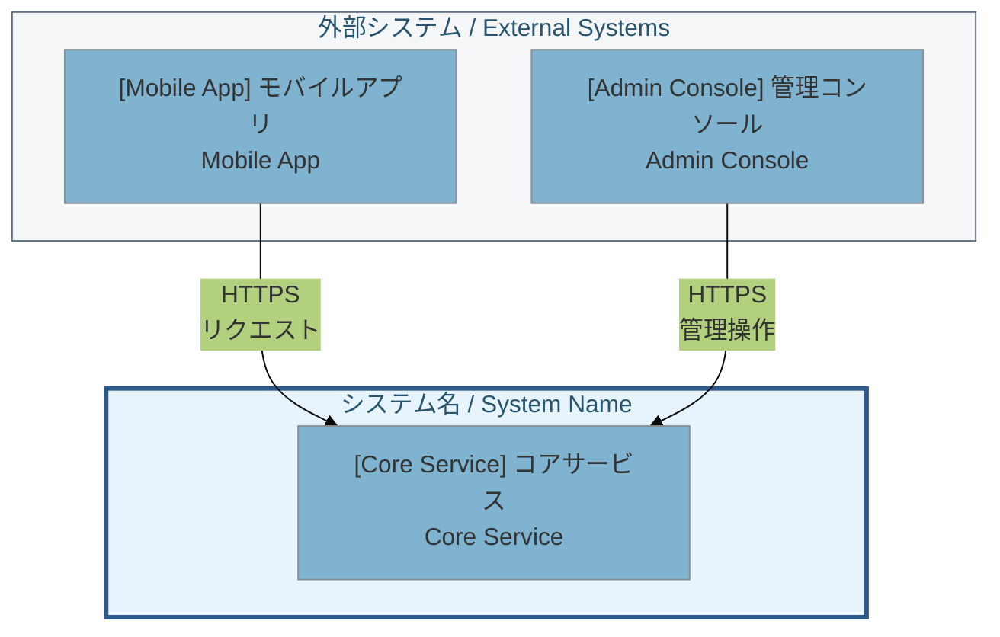
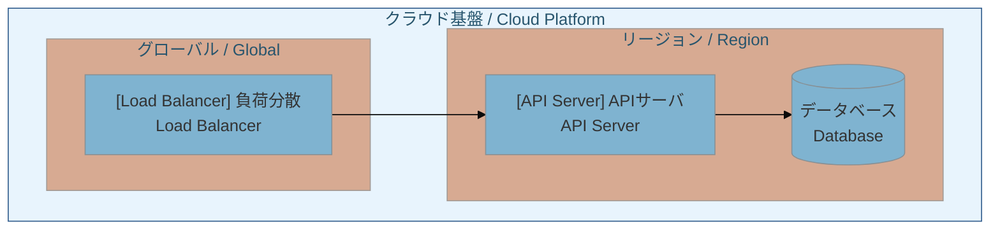
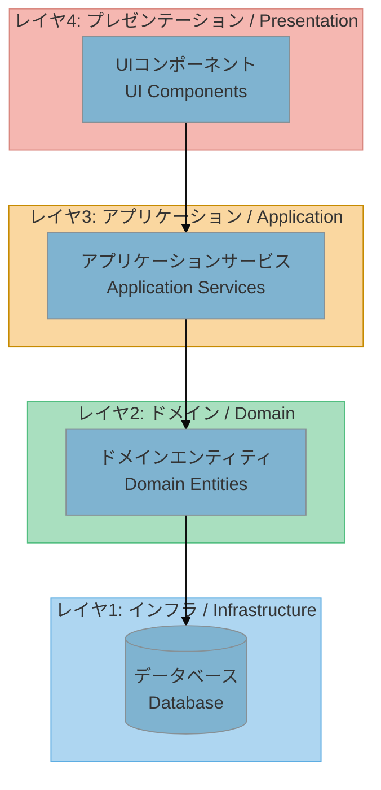
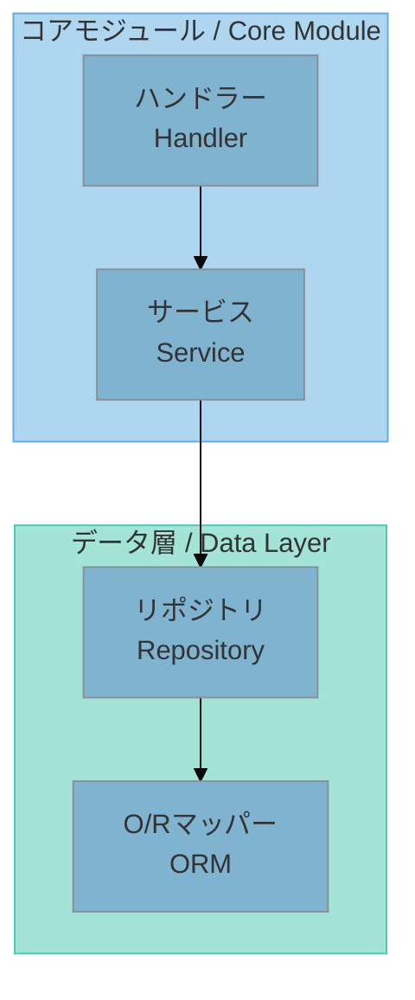
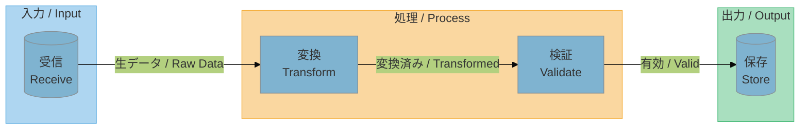
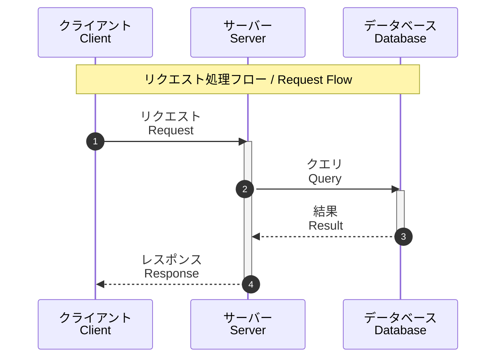
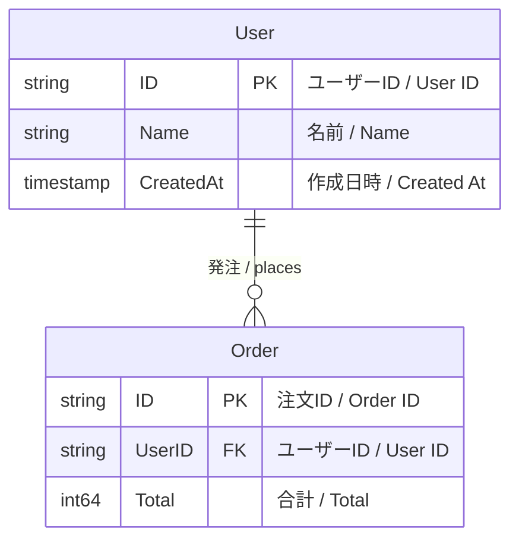
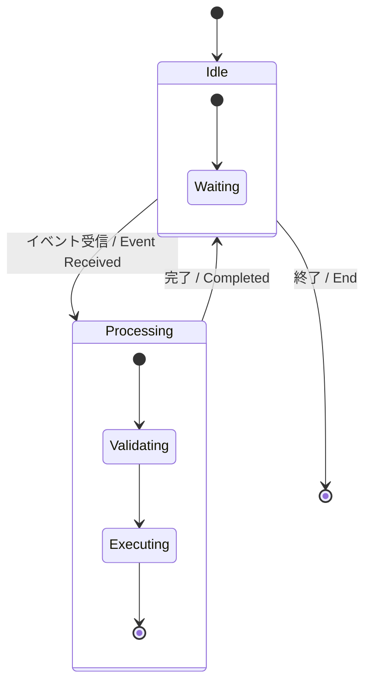
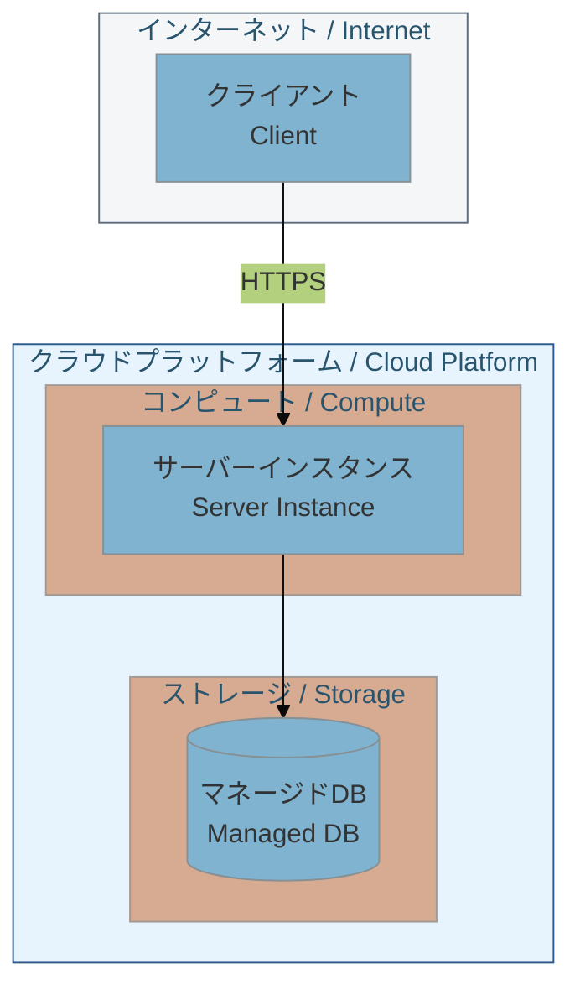
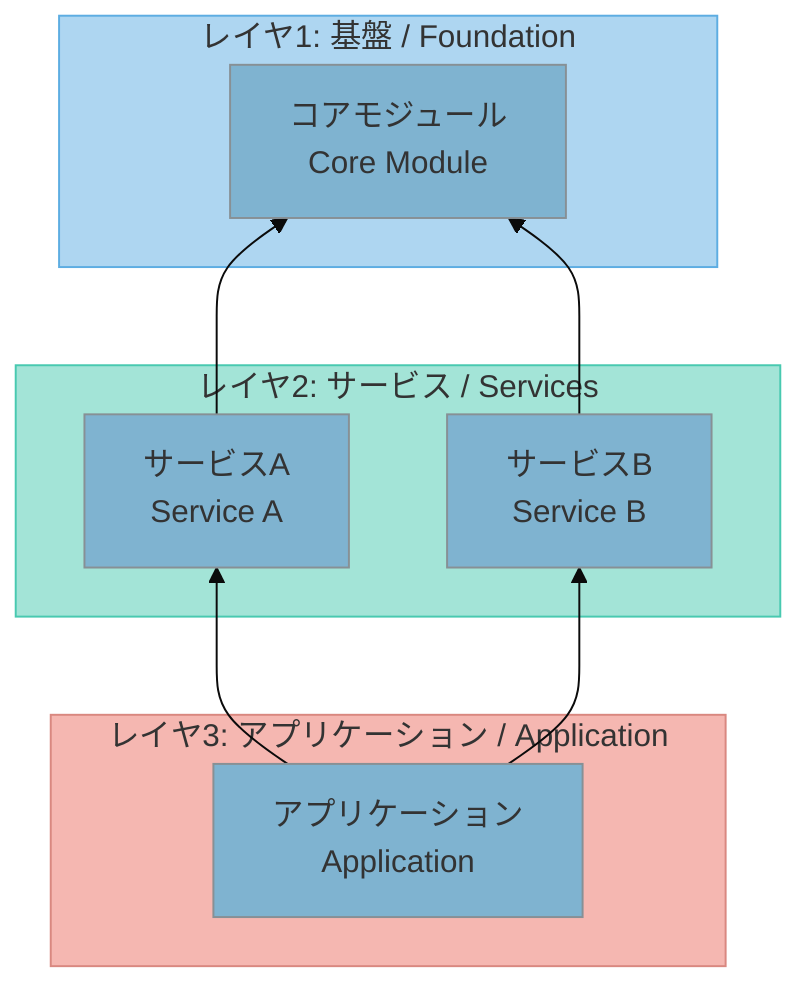

# Mermaid図パターン / Mermaid Diagram Patterns

## 目次 / Table of Contents
1. [テーマ設定 / Theme Configuration](#theme-configuration)
2. [配色 / Color Schemes](#color-schemes)
3. [システムコンテキスト / C4 System Context](#c4-system-context)
4. [コンテナ / C4 Container](#c4-container)
5. [レイヤードアーキテクチャ / Layered Architecture](#layered-architecture)
6. [コンポーネント図 / Component Diagram](#component-diagram)
7. [データフロー / Data Flow](#data-flow)
8. [シーケンス図 / Sequence Diagram](#sequence-diagram)
9. [エンティティ関係図 / ER Diagram](#er-diagram)
10. [状態図 / State Diagram](#state-diagram)
11. [デプロイ図 / Deployment Diagram](#deployment-diagram)
12. [依存関係図 / Dependency Diagram](#dependency-diagram)

---

## テーマ設定 / Theme Configuration

カスタム色つきの基本テーマ / Base theme with custom colors:
```mermaid
%%{init: {'theme': 'base', 'themeVariables': {
  'primaryColor': '#7FB3D0',
  'primaryTextColor': '#333',
  'primaryBorderColor': '#5DADE2',
  'lineColor': '#85929E'
}}}%%
```

---

## 配色 / Color Schemes

### レイヤー色 / Layer Colors - Pastel Palette
| レイヤー / Layer | Fill | Stroke |
|-------|------|--------|
| 入口 / Entry | `#5D6D7E` | `#4A4d60` |
| 表示 / Presentation | `#F5B7b1` | `#D98880` |
| アプリケーション / Application | `#FAD7A0` | `#C68A00` |
| サービス / Service | `#F9E79F` | `#D4AC00` |
| ドメイン / Domain | `#A9DFBF` | `#52BE80` |
| データアクセス / Data Access | `#A3E4D7` | `#48C9B0` |
| インフラ / Infrastructure | `#AED6F1` | `#5DADE2` |

### 地域色 / Region Colors - Pastel Palette
| 地域 / Region | Fill | Stroke |
|--------|------|--------|
| JP | `#FADBD8` | `#D98880` |
| US | `#FCF3CF` | `#F4D03F` |
| EU | `#D7BDE2` | `#BB8FCE` |

### コンポーネント色 / Component Colors - Pastel Palette
| 種別 / Type | Fill | Stroke |
|------|------|--------|
| コア / Core | `#AED6F1` | `#5DADE2` |
| データ / Data | `#A3E4D7` | `#48C9B0` |
| 入力 / Input | `#AED6F1` | `#5DADE2` |
| 処理 / Process | `#FAD7A0` | `#F5B041` |
| 出力 / Output | `#A9DFBF` | `#52BE80` |

---
## システムコンテキスト / C4 System Context


---

## コンテナ / C4 Container


---
## レイヤードアーキテクチャ / Layered Architecture


---
## コンポーネント図 / Component Diagram


---
## データフロー / Data Flow


---
## シーケンス図 / Sequence Diagram


---
## エンティティ関係図 / ER Diagram


---
## 状態図 / State Diagram


---
## デプロイ図 / Deployment Diagram


---
## 依存関係図 / Dependency Diagram

