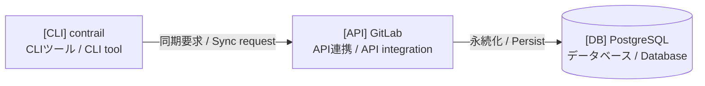

# SysViz Diagram Generator

repository analysis から正確な Mermaid diagrams を生成し、local SysViz app 用に保存する。これは diagram workflow の SysViz-specific variant。user が明示しない限り、artifacts は target repository 内ではなく `~/.contrail/sysviz/projects/<project-id>/diagrams/` に置く。

## 出力先

`.mmd` files:

```text
/home/mizuki2/.contrail/sysviz/projects/<project-id>/diagrams/
```

PNG render が成功した場合も同じ directory に保存する。

### Project ID

`<project-id>` はこの順に決める。

1. matching SysViz manifest があればその `id`
   - `/home/mizuki2/.contrail/sysviz/projects/*/manifest.json` を探す
   - `repoRoot` が target repository root と一致する manifest を優先
2. なければ `git -C <target-dir> rev-parse --show-toplevel` の repository root directory name
3. Git repository でなければ target directory basename
4. lowercase kebab case に normalize。spaces / underscores は `-`、letters/numbers/`-` 以外は削除

選択 project に `manifest.json` がなければ minimal manifest を作る。

```json
{
  "id": "<project-id>",
  "label": "<Human readable project name>",
  "repoRoot": "<absolute target repository root>"
}
```

`/home/mizuki2/.contrail` への write は sandbox 外の可能性がある。write に失敗したら必要に応じて escalation を依頼して続行する。

## ワークフロー

1. repository を直接 inspect する
   - discovery は `rg` / `rg --files`
   - manifests / build files: `package.json`, `Cargo.toml`, `go.mod`, `pyproject.toml`, `pom.xml`, `build.gradle`, framework config, Docker/Kubernetes, CI, OpenAPI, routes/controllers, models/schemas, entry points
   - directory boundaries、imports、routes、commands、jobs、UI actions、data models、queues、APIs、infrastructure を cross-check
   - uncertain relationships は explanation で inferred と扱い、fact として出さない
2. drawing 前に project を分類する
   - type: backend API、full-stack app、microservices、CLI/library、desktop app、mobile app、infrastructure/tooling、mixed
   - size: file count、module boundaries、routes、models、commands、services、dependency complexity から small/medium/large
   - main modules: source structure と runtime entry points から導く
3. diagrams selection criteria を user に説明する

   ```markdown
   ## 図の選択基準

   **プロジェクト分析結果:**
   - タイプ: ...
   - サイズ: ...
   - 主要モジュール: ...

   **選択した図:**
   | 図 | 選択理由 |
   |---|---|
   | ... | ... |

   **選ばなかった図:**
   | 図 | 理由 |
   |---|---|
   | ... | ... |

   **保存先:** `/home/mizuki2/.contrail/sysviz/projects/<project-id>/diagrams/`
   ```

4. fit で diagrams を選ぶ

   | Project type | Recommended diagrams |
   |---|---|
   | Backend API | System Context, Container, Component, Sequence, ER, Deployment |
   | Full-stack | System Context, Container, Component, Data Flow, Sequence, ER, Deployment |
   | Microservices | Container, Component, Data Flow, Sequence, Deployment, Dependency |
   | CLI/Library | Component, Dependency, Data Flow, Sequence |
   | Desktop/Mobile | System Context, Component, Data Flow, State |
   | Infrastructure/tooling | Deployment, Dependency, Data Flow |

   shallow diagrams を大量に作るより、少数の正確な diagrams を優先する。evidence が足りない ER/state/deployment は skip する。

5. Mermaid files を生成する
   - SysViz wide-screen viewing では既定 `flowchart LR`
   - layers / inheritance など vertical relation では `TB` / `BT`
   - subgraph/node/edge label は日本語と English を含める
   - actual module、file、route、function、class、service、table、command names を使う
   - logical boundaries は subgraphs
   - emoji ではなく `[CLI]`, `[API]`, `[DB]`, `[User]`, `[Service]` の tags
   - Mermaid node IDs は ASCII / stable
   - pastel colors と readable text colors
   - syntax/color patterns は `references/mermaid-patterns.md`
6. artifacts を保存する

   ```text
   01_system_context.mmd
   02_container_view.mmd
   03_layered_architecture.mmd
   04_component_view.mmd
   05_data_flow.mmd
   06_sequence_flow.mmd
   07_er_diagram.mmd
   08_state_diagram.mmd
   09_deployment.mmd
   10_dependency.mmd
   ```

7. 可能なら PNG render

   ```bash
   python3 /home/mizuki2/.codex/skills/sysviz/scripts/render_diagrams.py /home/mizuki2/.contrail/sysviz/projects/<project-id>/diagrams --scale 4
   ```

   renderer は `@mermaid-js/mermaid-cli` の `mmdc` が必要。使えない場合や失敗した diagram は `.mmd` を残し、skip を報告する。

## Mermaid Label Rules

```mermaid
subgraph Group["日本語 / English"]
```

```mermaid
Node["[TAG] Name<br/>日本語説明 / English description"]
```

```mermaid
A -->|"日本語 / English"| B
```

example:



## Accuracy Checklist

- manifests / config files を読む
- runtime entry points を特定する
- source structure / imports から module boundaries を特定する
- API routes、commands、jobs、UI actions を handlers と照合する
- ER diagrams 前に data models を確認する
- deployment diagrams 前に infrastructure files を確認する
- inferred relationships は overclaim せず explanation に明示する

## Resources

- `scripts/render_diagrams.py`: Mermaid CLI で `.mmd` を PNG render
- `references/mermaid-patterns.md`: common architecture diagram types 用 Mermaid templates
